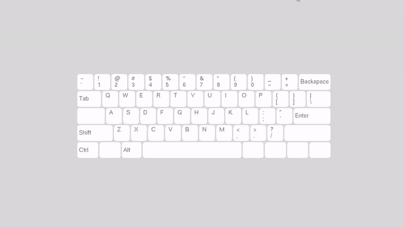
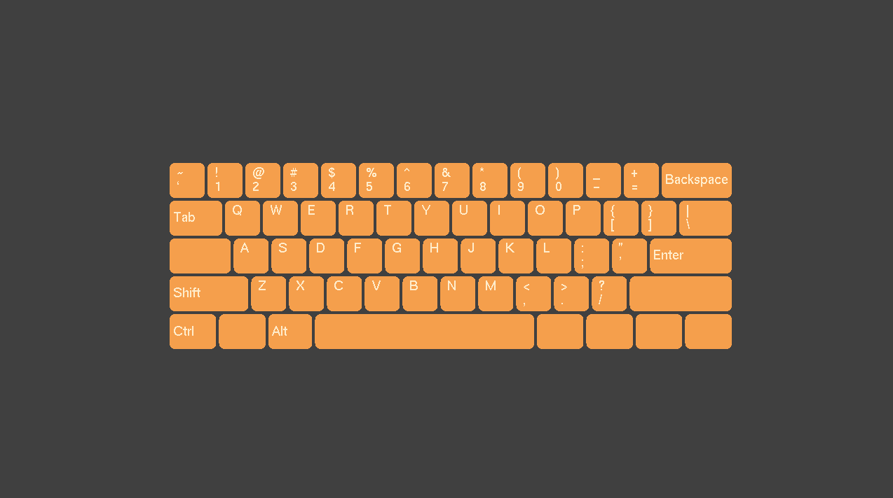
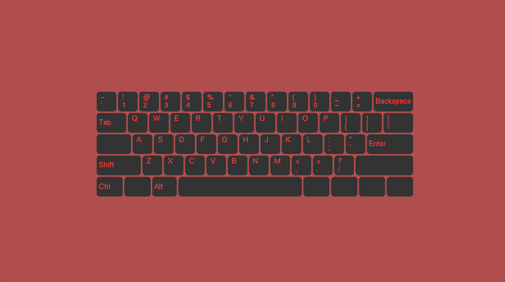
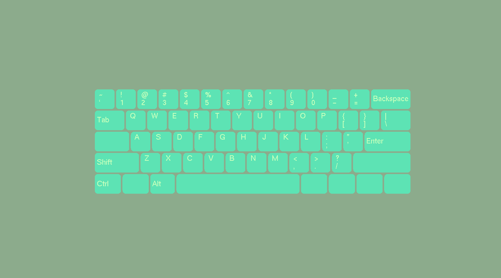
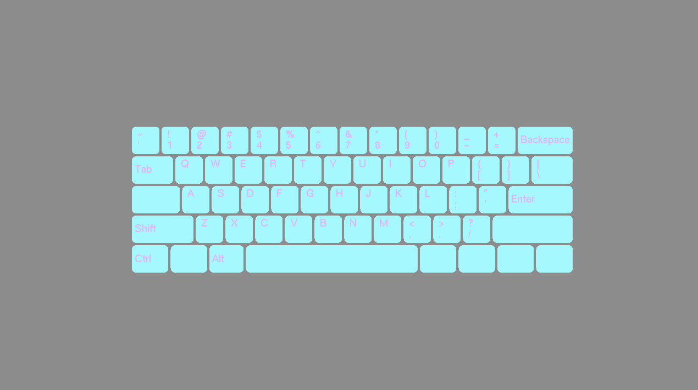

# KEYBRD SIM 2D
KEYBRD SIM 2D is an interactive 2D 60% Keyboard simulator.

Type away and watch your keystrokes come to life onscreen!

Quick Demo:

Sample Photos:

# Program Overview
-Upon opening, the user is met with the first keyboard style, and can begin typing immediatley

-Pressing left or right click will cause the color scheme to change in order

-Enjoy the beatiful color and typing mechanics!

# How To Run Program
1. Make sure user is able to run C++ and openGL GLUT/freeGLUT
2. Download all files from repository into a folder
3. Launch main.exe and run

Happy Typing!
